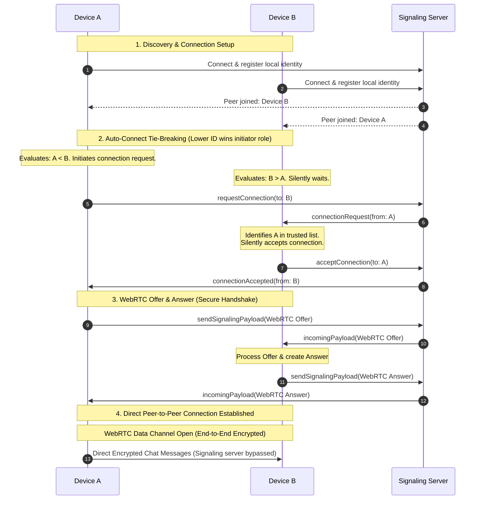

# Ping2Peer 📡💬

Ping2Peer is a secure, decentralized, serverless-first instant messenger designed for local networks. It uses **WebRTC Data Channels** to send messages directly from device to device with end-to-end encryption, utilizing local signaling to discover nearby peers dynamically.

---

## 🏗️ Architecture & Connection Protocol

Below is the connection orchestration flow between devices, illustrating discovery, deterministic auto-reconnect, WebRTC offer/answer handshakes, and smart glare resolution:



### 🤝 Smart Glare Resolution
When both devices trigger connection requests simultaneously (due to manual intervention, old code, or packet delays), it creates a WebRTC "Glare" conflict.
* **Deterministic Resolution:** Devices compare their unique cryptographic IDs lexicographically.
* **Initiator Role:** The device with the **alphabetically lower ID** keeps its initiator status.
* **Acceptor Role:** The device with the **alphabetically higher ID** cancels its own outgoing request and automatically yields to accept the other's request.
This logic runs entirely client-side and requires zero signaling rounds to resolve.

---

## 🛠️ How to Self-Host the Signaling Server

The signaling server manages peer discovery. It can be hosted locally for development or deployed serverless on AWS.

### Option A: Local Python Server (Fast Dev & Testing)

The project includes a lightweight local Python server that acts as a WebSocket relay:

1. **Prerequisites:** Install Python 3.8+.
2. **Install Dependencies:**
   ```bash
   pip install websockets
   ```
3. **Run the server:**
   ```bash
   cd signal-server
   python local_server.py
   ```
   * The server runs on `ws://localhost:8080` by default.
   * Enable **Custom Signal Server** in your client settings and set it to `ws://YOUR_COMPUTER_IP:8080`.

---

### Option B: AWS Lambda & API Gateway (Serverless Production)

To deploy a global, scalable production-ready signaling server on AWS:

#### 1. Setup AWS CLI & SAM CLI
Ensure you have the AWS CLI and AWS SAM (Serverless Application Model) CLI installed:
* [AWS CLI Installation Guide](https://docs.aws.amazon.com/cli/latest/userguide/getting-started-install.html)
* [AWS SAM CLI Installation Guide](https://docs.aws.amazon.com/serverless-application-model/latest/developerguide/install-sam-cli.html)

#### 2. Configure AWS Profile
Configure your credentials. In this project, we are using a profile named `p2p`:
```bash
aws configure --profile p2p
# Default region: us-east-1
# Default output format: json
```

#### 3. Build & Deploy
We use AWS SAM to deploy the resources defined in `template.yaml` (DynamoDB table `Ping2Peer-connections` and Lambda handler):
```bash
cd signal-server
sam build
sam deploy --guided --profile p2p
```

During guided configuration, choose:
* **Stack Name:** `ping2peer-signal`
* **AWS Region:** `us-east-1`
* **Confirm changes before deploy:** `Yes`
* **Allow SAM CLI IAM role creation:** `Yes`
* Save settings to `samconfig.toml` for future one-step deploys (`sam deploy`).

#### 4. Configure Client
Once deployed, AWS will output your WebSocket URI (e.g., `wss://xxxxxx.execute-api.us-east-2.amazonaws.com/prod`). Turn on **Custom Signal Server** in Settings and enter your new address.

---

## 💻 Client Local Development

1. **Install Node.js 18+**
2. **Install Dependencies:**
   ```bash
   npm install
   ```
3. **Start the Vite Dev Server (with Local HTTPS):**
   ```bash
   npm run dev
   ```
   * Vite will spin up a secure HTTPS server using `@vitejs/plugin-basic-ssl`.
   * Access it on your phone or local devices via `https://<YOUR_LOCAL_IP>:5173`.
   * *Note:* You must bypass the self-signed SSL warning in the mobile browser to allow WebCrypto secure APIs to work.
